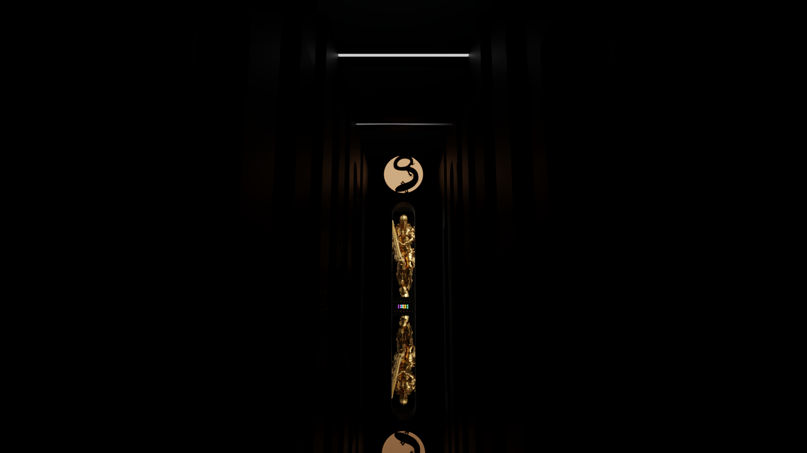

# Goblin Mod
#### General Networking, Rendering, and Physics Framework for Unsharded 10,000+ Interacting MMOFPS Players

#### News

October 24, 2023: Alpha release delayed as we focus on porting the G.O.B. (acronym remains a secret) engine to a pure, real-time path-tracing engine. Currently it is using a traditional Z-buffer rasterization. Preliminary results of real-time ray tracing shows faster performance than rasterization at the scale of rendering 10,000 high-poly models. Mind-blowing stuff. The original rasterization prototype schedule still runs in parallel for use in testing.

#### Introduction

This project started as a feasibility study for a PlanetSide 3 for 10,000 concurrent players, for the sake of a Goblin Tribe April Fools' video (with a FrogMike related punchline).

We ended up implementing an entire Networking + Rendering + Physics framework as a general solution for 10,000+ MMOFPS games with no sharding.

This framework allows for custom servers for different network/rendering/physics options: client/server authoritative, ping limits, interpolation, tick rate, weapon balance, TTK, headshot multiplier, sharding, and so on. If a player doesn't like the available game modes, they can start their own custom server.

#### Major Alpha Milestones

The following major Alpha milestones were completed on August 24, 2023:

* Real-time (240 FPS at 1080p on a GTX 1070m test laptop) rendering of 10,000 high poly animating models (40K vertices each)
* 10Gbps worst-case upload bandwidth for unsharded real-time network updates of all 10,000 players sent to each player
* Real-time physics for all 10,000 models

Not only does completing these milestones guarantee that whatever happens to PlanetSide 2 it can be recreated as-is given a community effort to import 3D assets and animations, completing them also guarantees orders of magnitude faster rendering, physics, and server performance.

This repository was made private following completion of major Alpha milestones to protect Alpha release and is planned to be made fully open source again on Beta. Weekly builds under https://github.com/PlanetSideGoblinMod/GoblinModeDemo/tags were removed.

#### Alpha Release: Goblin Mode

Major Alpha milestones do not include a fun, playable game. The remaining tasks are not nearly as complex as the major milestones, but they are nonetheless time-intensive such as movement/physics tests, network tests, usability tests, and most important of all, fun tests.

Alpha Release is planned to test the worst-case game mode called Goblin Mode, which is the minimum "playable" physics for 10,000 unsharded concurrent players with a maximum 10Gbps server upload bandwidth. Goblin Mode as a default game mode is meant to attract and keep the highest amount of players possible. Since Goblin Tribe is a competitive gaming clan, there will be an alternate, competitive game mode with options for CS2-style "subticks" among other detailed customizations.

#### Acknowledgements and Dedication

This project is dedicated to Goblin Tribe including GOB competitive and ex-members, the PlanetSide staff who made this scale of MMOFPS possible, and all of our friends in the PlanetSide 2 community. This project is also especially dedicated to FrogMike, Therum, Beefy, and my best PS2 friend Zagszy.

This project would not have begun if SadRobot didn't oblige in participating in our "How Would We Design PlanetSide 3 If We Programmed In Goblin Mode?" seemingly-schizophrenic brainstorming sessions to come up with an "unapologetically self-indulgent, lazy, slovenly, or greedy, typically in a way that rejects social norms or expectations" worst-case solution called the Goblin Mode (meme) Architecture. Special thanks to Khorror's cracked 3D modeling skills. Much gratitude for Riesz, Encoder, and FatherTime for voices. Thanks to everyone who encouraged, supported, adviced, tested, and critically examined the project: TJ, Blaxxen, Sobek, Khorror, SadRobot, Riesz, Encoder, LostArrow (Marauder), Atlia, PotatoBoiler, Chicken, Bazuki, NP_Eazy, BerkleianMegatrends, Spjalle, and GoblinRum. Infinite thanks to Goblin Tribe, especially FrogMike and Sobek, for letting the world witness one of the greatest underdog stories in history. Thanks to the Berkeley EECS community of cracked engineers for technical consultations, moral encouragement, and for offering the CSUA Minifridge for server hosting (lol).

Thanks for the patience rly sry about the delays lmao also fuku Calskey
